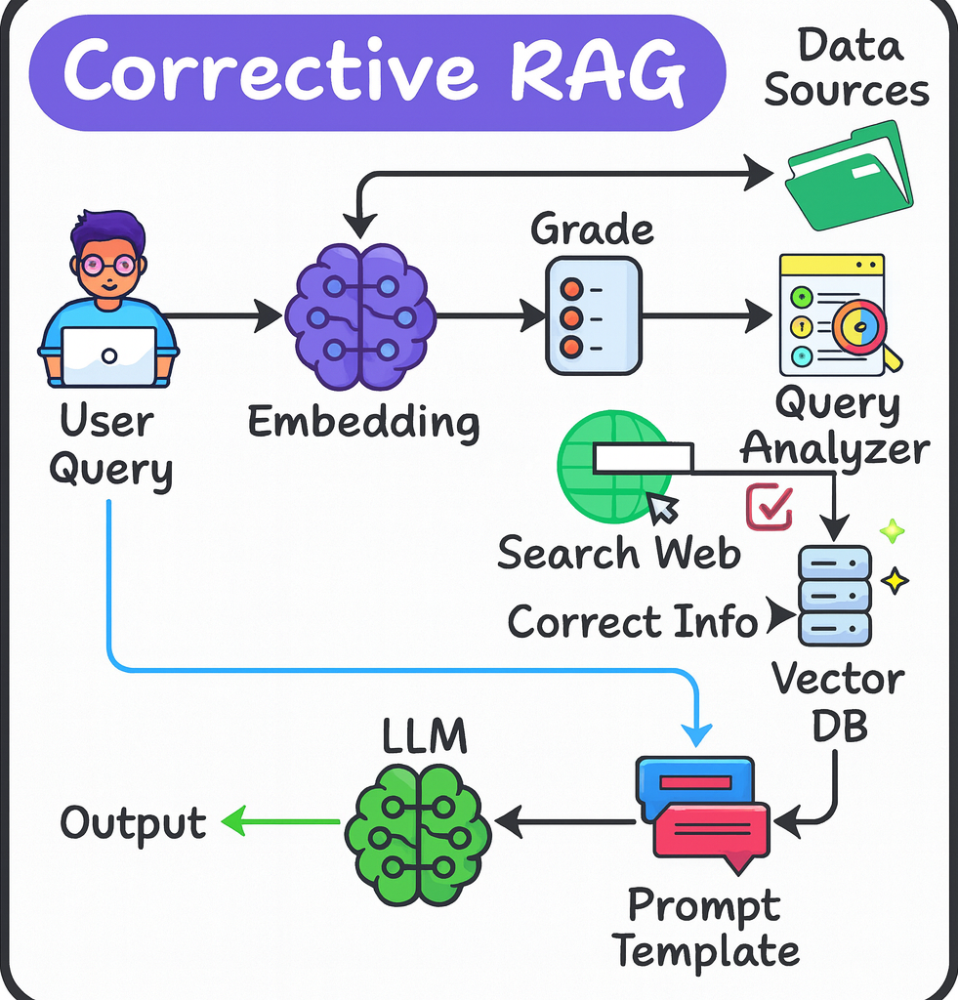

# PitchLens: AI-Powered Startup Pitch Analyzer

A sophisticated AI application that analyzes startup pitch documents using advanced Corrective Multi-modal RAG technology with intelligent web search correction.

## 🚀 Features

### Core Capabilities
- **Advanced RAG System**: Intelligent document analysis with semantic search
- **Multi-Format Support**: PDF, PowerPoint, Word, CSV, and image files (with OCR)
- **Web Search Integration**: Real-time market research and competitive intelligence
- **Smart Fallback**: Seamlessly switches between document analysis and web search
- **Professional Analysis**: Startup-focused insights for investors and founders

### AI-Powered Analysis
- **Business Model Validation**: Market opportunity assessment
- **Competitive Analysis**: Landscape and positioning insights
- **Financial Projections**: Funding needs and growth potential
- **Risk Assessment**: Identification and mitigation strategies
- **Strategic Recommendations**: Actionable business insights

## 🛠️ Installation

### Prerequisites
- Python 3.8+
- Tesseract OCR engine

### Tesseract Installation

#### Windows
```bash
# Download and install from: https://github.com/UB-Mannheim/tesseract/wiki
# Add to PATH: C:\Program Files\Tesseract-OCR
```

#### macOS
```bash
brew install tesseract
```

#### Linux
```bash
sudo apt-get install tesseract-ocr
```

### Setup
1. **Clone the repository**
   ```bash
   git clone <repository-url>
   cd PitchLens
   ```

2. **Create virtual environment**
   ```bash
   python -m venv .venv
   .venv\Scripts\activate  # Windows
   source .venv/bin/activate  # macOS/Linux
   ```

3. **Install dependencies**
   ```bash
   pip install -r requirements.txt
   ```

4. **Environment variables**
   Create a `.env` file with:
   ```env
   OPENAI_API_KEY=your_openai_api_key
   TAVILY_API_KEY=your_tavily_api_key
   ```

## 🎯 Usage

### Getting Started
1. **Launch the application**
   ```bash
   streamlit run app.py
   ```

2. **Upload your documents** (PDF, PPTX, DOCX, CSV, images)
3. **Ask questions** about your startup materials
4. **Get AI-powered insights** with professional analysis


### Extra Features
- **Clear Database**: Removes all files, indexes, and chat history
- **Reset Chat**: Clears conversation while preserving documents
- **File Upload**: Supports multiple formats with intelligent processing

## 🔧 How It Works



*The corrective RAG pipeline combines your documents with real-time web search for comprehensive insights.*

### How the Corrective Multimodal RAG Works

#### 1. Document Processing
- **Multi-format Support**: Handles multiple input formats such as PDFs, PowerPoints, Word docs, CSVs, and images with OCR. 
- **Intelligent Chunking**: Breaks documents into searchable pieces while preserving context
- **Vector Embeddings**: Converts text into AI-understandable representations for semantic search

#### 2. Intelligent Retrieval
- **Semantic Search**: Finds the most relevant and up-to-date document sections based on your question
- **Coverage Assessment**: Measures how well your documents answer the question
- **Smart Fallback**: Works even when no documents are uploaded

#### 3. Web-Enhanced Correction
- **Automatic Web Search**: Triggers when document coverage is insufficient
- **Real-time Data**: Brings in current market trends, competitive intelligence, and industry insights
- **Combined Analysis**: Merges document knowledge with web research for comprehensive answers 

### User Experience
- **Clean Interface**: Intuitive Streamlit web app
- **Smart Fallback**: Works with or without documents
- **Real-time Results**: Immediate insights with live web search when needed

## 📊 Supported File Types

| Format | Extension | Processing Method |
|--------|-----------|-------------------|
| PDF | `.pdf` | Text extraction |
| PowerPoint | `.pptx` | Slide content |
| Word | `.docx` | Rich text |
| CSV | `.csv` | Tabular data |
| Images | `.png`, `.jpg`, `.jpeg`, `.tiff`, `.tif` | OCR processing |

## 🔑 API Requirements

- **OpenAI API**: For embeddings and text generation
- **Tavily API**: For web search and market research

## 📈 Use Cases

- **Startup Founders**: Validate business models and strategies
- **Investors**: Analyze pitch materials and market opportunities
- **Business Consultants**: Provide strategic insights and recommendations
- **Students**: Learn startup analysis and business strategy
- **Researchers**: Market analysis and competitive intelligence

## 🤝 Contributing

1. Fork the repository
2. Create a feature branch
3. Make your changes
4. Submit a pull request

---

**PitchLens** - Transform your startup documents into actionable business insights with AI-powered analysis.
